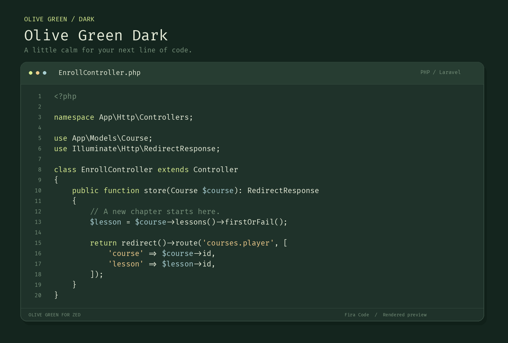
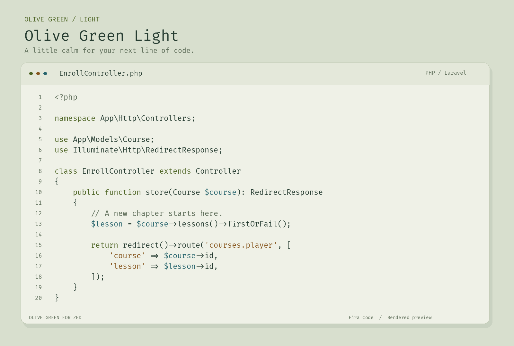

# Olive Green for Zed

Two nature-inspired themes for [Zed](https://zed.dev):

- **Olive Green Dark** — deep green backgrounds, soft ivory text, lime keywords, warm gold strings, and pale teal variables.
- **Olive Green Light** — warm ivory backgrounds, forest-green text, olive keywords, ochre strings, and deep teal variables.

## Previews

### Olive Green Dark



### Olive Green Light



Rendered code previews using the theme palette and Fira Code. Zed’s interface and language highlighting may differ.

## Install now

Copy `themes/olive-green.json` into `~/.config/zed/themes/`, then restart Zed and select **Olive Green Dark** or **Olive Green Light** using `theme selector: toggle`.

Alternatively, clone this repository and run `zed: install dev extension`, selecting the repository directory.

Registry publication is pending. Once accepted, search for **Olive Green** in Zed Extensions.

## Follow system appearance

Merge this into your Zed settings:

```json
{
  "theme": {
    "mode": "system",
    "light": "Olive Green Light",
    "dark": "Olive Green Dark"
  }
}
```

## Optional coding font

The extension changes colors only. Install Fira Code separately if needed and merge these settings to use programming ligatures:

```json
{
  "buffer_font_family": "Fira Code",
  "buffer_font_size": 18,
  "buffer_font_weight": 400,
  "buffer_line_height": { "custom": 1.5 },
  "buffer_font_features": { "calt": true }
}
```

These settings affect the coding font, not the IDE interface font. Font size is a personal preference and depends on display scaling.

## License

[MIT](LICENSE)
